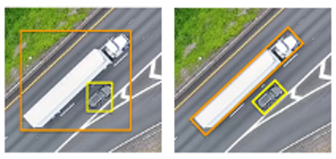
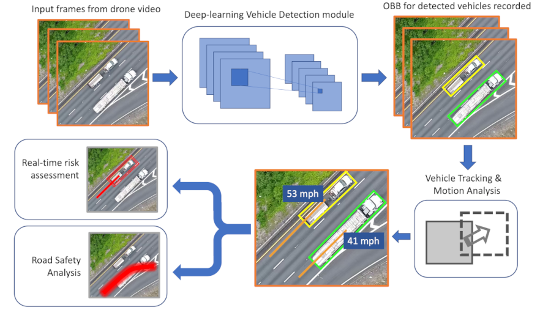
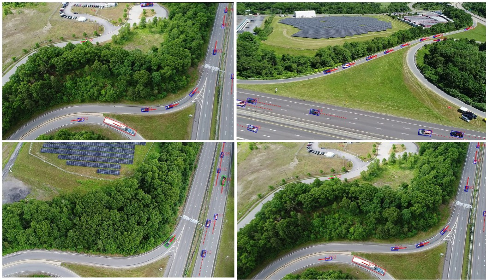
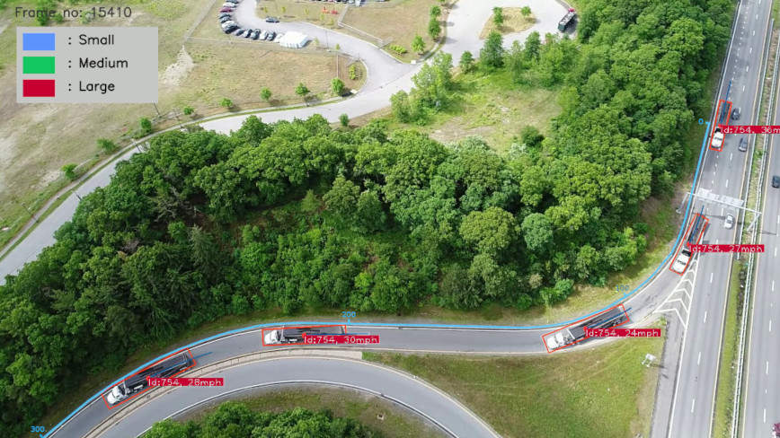
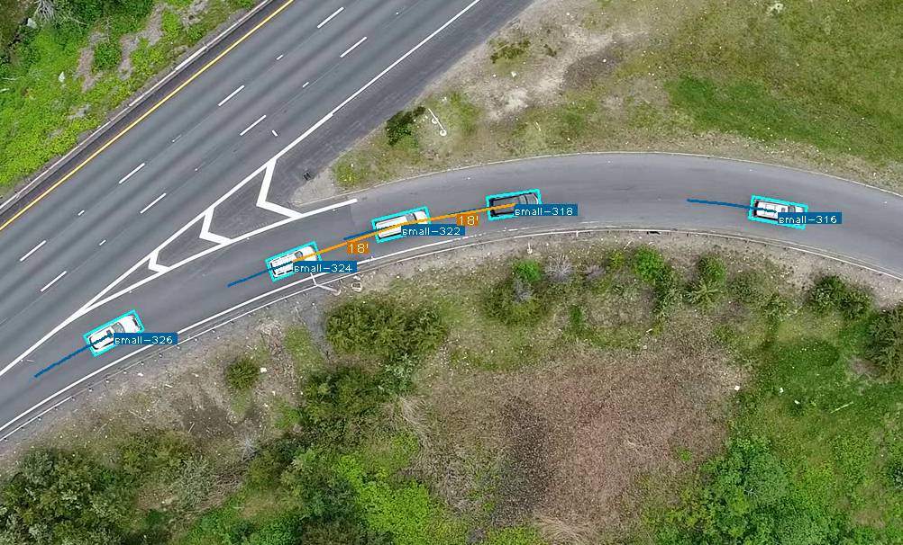
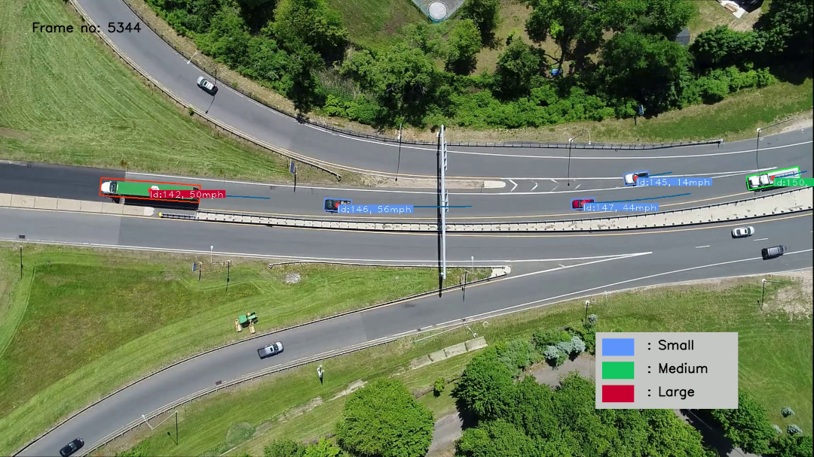
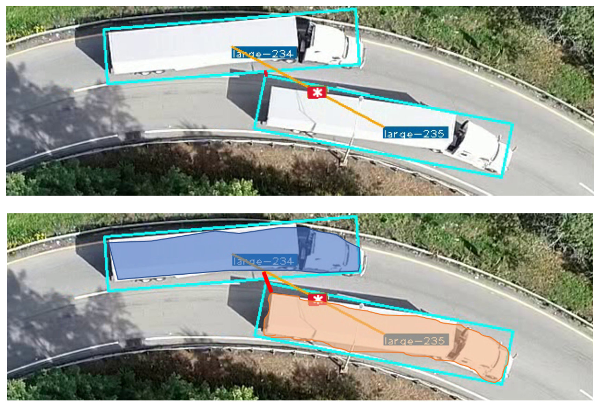
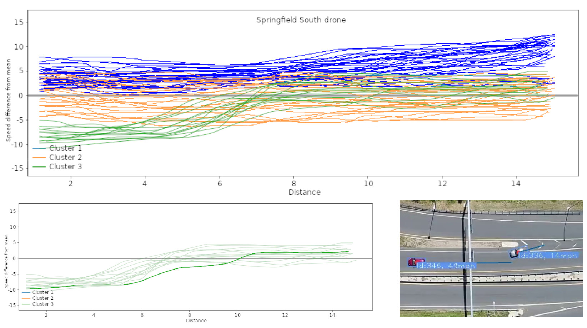

# Uncovering the Root Causes to Truck Rollover Crashes on Ramps

### Vehicle detection using modified Mask-RCNN: Oriented Bounding Box (OBB) + instance segmentation.

## Introduction

Highway ramps often witness truck rollover crashes, causing significant congestion and roadblocks. This research aimed to understand the primary causes of these incidents, utilizing drones to collect traffic videos at seven high-risk ramps in Massachusetts. The study includes the development of a model for vehicle detection and various algorithms for tracking vehicles, extracting trajectories, and identifying high-risk events such as unsafe lane changes.

> Z. Bhuyan, Q. Chen, Y. Xie, Y. Cao and B. Liu, "Modeling the Risk of Truck Rollover Crashes on Highway Ramps Using Drone Video Data and Mask-RCNN," 
2023 IEEE 26th International Conference on Intelligent Transportation Systems (ITSC), Bilbao, Spain, 2023, pp. 4052-4058, 
doi: 10.1109/ITSC57777.2023.10421999.

[Link to paper](https://ieeexplore.ieee.org/document/10421999)

[Link to Full Report](https://www.umasstransportationcenter.org/Document.asp?DocID=1199)

### Funding agency

The research was funded by the Massachusetts Department of Transportation (MassDOT). However, the data analysis, findings and conclusions in this paper are the responsibility of the authors only and do not represent the official policy of the MassDOT. 

## Methodology

1. **Data Collection:**
   - Drones were employed to gather traffic videos at seven identified high-risk ramps.
   - Developed a model for vehicle detection using advanced algorithms.

2. **Analysis:**
   - Extracted vehicle trajectories and identified high-risk events, including last-minute lane changes.
   - Reviewed crash narratives from January 2015 to February 2022 for all ramp truck rollovers in Massachusetts.

3. **Infrastructure Investigation:**
   - Examined the locations, types of traffic signs, slopes, and curve radii of the seven identified ramps.

## Findings

1. **Crash Characteristics:**
   - Over 95% of ramp truck rollovers were identified as single-vehicle crashes.
   - Speeding emerged as the predominant cause.

2. **Safety Improvement Recommendations:**
   - Provided practical and specific safety improvement recommendations based on the analysis.

## HBB vs OBB

Substantial advancements have been achieved in vehicle detection from aerial images; however, certain challenges persist, distinguishing it as a specialized instance of the general object detection problem. A key hurdle arises due to the diverse orientations of objects, such as vehicles, in drone videos. Conventional horizontal bounding boxes prove inadequate as they might encompass substantial non-object space. Additionally, densely packed and tilted arrangements of objects could lead to missed detections when applying non-maximum suppression.

Furthermore, traditional object detection datasets and models based on Convolutional Neural Networks (CNN) encounter difficulty in distinguishing between background structures and vehicles. In response to these challenges, oriented bounding boxes (OBBs) emerge as a preferred solution for processing drone-captured traffic videos. OBBs effectively enclose vehicles, mitigating the inclusion of extraneous background space. This proves particularly beneficial in accurately detecting larger vehicles such as heavy trucks and buses that exhibit extended dimensions.



*An instances where OBBs are better suited than horizontal (or axis-aligned) bounding boxes.*

## Proposed Pipeline Diagram

High-level representation of the proposed pipeline is illustrated in the figure below. The pipeline incorporates a deep-learning vehicle detection module based on an oriented-mask-RCNN architecture, which has been trained on our dataset to enhance accuracy and efficiency in identifying vehicles. Following detection, the pipeline employs a novel tracking algorithm designed specifically for tracking the Oriented Bounding Boxes (OBBs) of vehicles.



*High-level representation of the proposed pipeline.*

The deep-learning vehicle detection module plays a crucial role in identifying vehicles within the input data, while the tracking algorithm enhances the tracking precision by focusing on the orientation of vehicle bounding boxes. This integrated approach aims to provide a robust and effective solution for modeling the risk of truck rollover crashes on highway ramps using drone video data and Mask-RCNN.

Traditional tracking algorithms are typically tailored for horizontal bounding boxes, posing a challenge for scenarios requiring orientation-aware tracking, such as ours with Oriented Bounding Boxes (OBB). Our specific video data characteristics, lacking abrupt occlusions or random object disappearances, allowed us to design a minimal and efficient tracking algorithm tailored to our needs. This algorithm relies on the intersection-over-union ratio of a given vehicle in consecutive frames to ensure accurate and effective tracking.



*Visualization of the detection module output with basic tracking without trajectory smoothing.*

## Speed Estimation and Event Identification

The algorithm incorporates a smoothing component to eliminate unwanted noise in the generated vehicle trajectories, ensuring accurate and reliable results. To map pixel widths to distance units such as miles or kilometers, a calibration process is employed. This involves measuring the lengths of known dimensions, such as a semi-trailer with a length of 53 feet or 16.154 meters. By analyzing how the trailer's length varies across different parts of the roadway in the video frame, the algorithm calculates pixel widths in corresponding regions.


*Mapping pixel widths to distance units.*

This calibrated information allows the algorithm to determine the instantaneous speed of each vehicle. The algorithm measures how much distance a vehicle covers in short periods, e.g., 0.5 seconds, providing a real-time estimation of speed. To validate this speed estimation method, the algorithm calculates the mean instantaneous speed along the trajectory and compares it with the average speed obtained using the length of the road and the total time required for the vehicle to traverse the distance.

The speed estimation, combined with trajectory results, becomes instrumental in automatically identifying high-risk events. These events include speeding, sudden decelerations, stalling, risky lane changes, and last-minute lane changes. Additionally, the algorithm introduces two generic algorithms specifically designed to detect stalling and slowing down on gore areas. These algorithms are versatile and can be applied across various locations without requiring modifications.



*Visualization of tracking with trajectory smoothing.*



*Visualization of tracking results and speed estimation with trajectory smoothing.*

Furthermore, the speed and trajectory data undergo processing using standard clustering algorithms, providing a comprehensive analysis of vehicular behavior. This multi-faceted approach enhances the algorithm's capability to detect and categorize events that contribute to the risk of truck rollover crashes on highway ramps, thereby contributing to the development of effective countermeasures.



*Calculating the distance between large vehicles can be tricky at times, especially when they are travelling close. In such situations we can use the segmentation mask information to accurately measure the distance. In the above figure the distance measured is shown with a solid red line.*




*Speed profile clustering.*


## Resources

- [Link to Full Report](https://www.umasstransportationcenter.org/Document.asp?DocID=1199)
- [MassDOT Innovation Webinar Series](https://www.umasstransportationcenter.org/umtc/MassDOT-Innovation-Series.asp)
- [Project Details on TRID](https://trid.trb.org/View/1851851)

## Video (Innovation Series Webminar)

- [Watch Innovation Series Webminar](https://vimeo.com/811280458)

## Acknowledgment

We want to acknowledge the invaluable assistance provided by the Massachusetts Department of Transportation (MassDOT) Aeronautics Division, which made the data collection possible. 

## Cite


```bibtex
@INPROCEEDINGS{10421999,
  author={Bhuyan, Zubin and Chen, Qilei and Xie, Yuanchang and Cao, Yu and Liu, Benyuan},
  booktitle={2023 IEEE 26th International Conference on Intelligent Transportation Systems (ITSC)}, 
  title={Modeling the Risk of Truck Rollover Crashes on Highway Ramps Using Drone Video Data and Mask-RCNN}, 
  year={2023},
  volume={},
  number={},
  pages={4052-4058},
  keywords={Road transportation;Vehicle detection;Rollover;Artificial neural networks;Traffic control;Drones;Videos},
  doi={10.1109/ITSC57777.2023.10421999}
}
```
